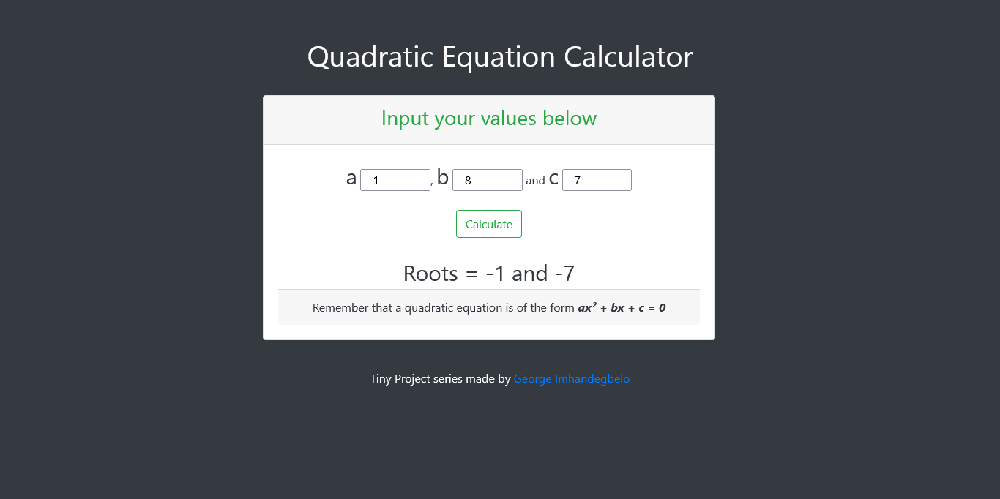

# This is a simple quadratic equation solver

## Table of contents

- [Overview](#overview)
  - [The challenge](#the-challenge)
  - [Screenshot](#screenshot)
  - [Links](#links)
- [My process](#my-process)
  - [Built with](#built-with)
  - [What I learned](#what-i-learned)
- [Author](#author)

## Overview

### The challenge

Users should be able to:

- Input values as text
- Accepted values must be of type numbers for execution
- Get response after code execution

### Screenshot

### Links

- Live Site URL: [Live site](https://my-live-site-url.com)

## My process

### Built with

- Semantic HTML5 markup
- CSS
- Bootstrap

### What I learned

This project - as simple as it may look - was an excellent practice for:
- Function scope
- Understanding isNaN
- Conditionals
Overall, I had fun building this tiny project

## Author

- Github - [Imhandegbelo](https://www.github.com/Imhandegbelo)
